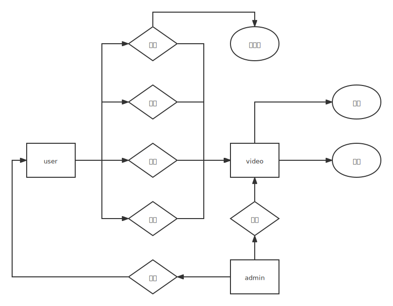

# VideoStation

West2 Assignment 4

## Project Structure

### 用户模块 (user)

#### 用户结构体

- [x] username 用户名
- [x] password 密码
- [x] avatars 头像
- [x] 个人资料
    - [x] 性别 gender
    - [x] 年龄 age
    - [x] 邮箱 email
- [x] 状态(是否封号) state
- [ ] 收藏列表

#### 方法

- [x] 用户登录
- [x] 用户注册
- [ ] 修改密码
- [ ] 获取用户资料
- [ ] 修改用户资料
- [ ] 获取收藏列表
- [ ] 拉黑用户

### 视频模块 (video)

#### 视频结构体

- [x] 视频文件主体

- [x] 状态
    - 待审核
    - 已审核
    - 草稿
- [x] 弹幕列表
- [ ] 点赞列表
- [x] 评论列表
- [ ] 转发数
- [ ] 收藏数

#### 弹幕结构体

- [x] 发送用户ID
- [x] 弹幕内容
- [x] 弹幕位置（在视频时间线的位置）

#### 评论结构体

- [x] 发送用户ID
- [x] 评论内容
- [x] 回复对象ID
    - [x] 置零为不回复，为视频评论

#### 方法

- [ ] 用户上传视频
- [ ] 用户点赞
- [ ] 用户评论
    - [ ] 楼中楼功能？没思路
- [ ] 用户收藏
- [ ] 用户转发
- [ ] 用户发送弹幕

### 管理员模块 (admin)

#### 管理员结构体

- [ ] adminName 管理员名
- [ ] adminPassword 管理员密码
- [ ] adminImg 管理员头像

#### 方法

- [ ] 获取待审核视频列表

  > 如何解决数个管理员同时管理一个视频的冲突情况？

- [ ] 封禁用户账号

